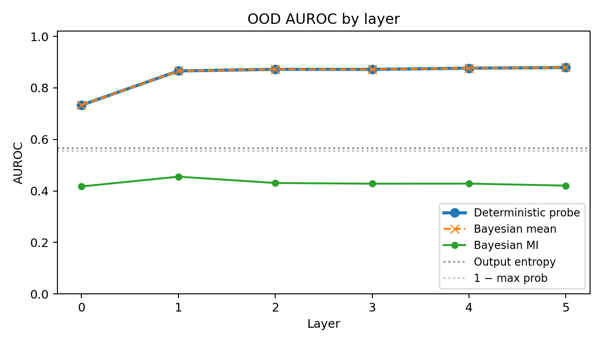
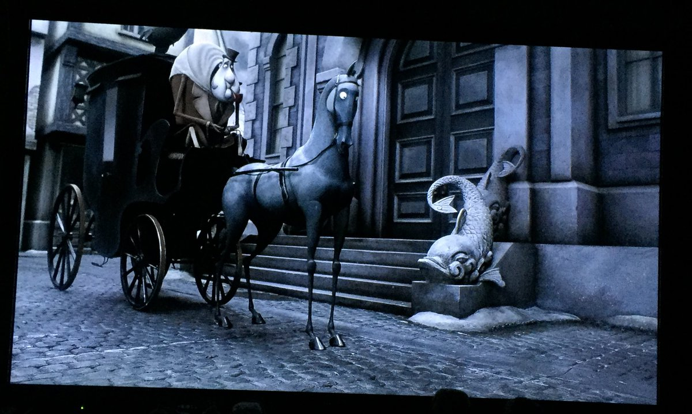

# DOWSING: Detecting OOD and Weird States in NanoGPT

[**Read the paper (PDF)**](report/dowsing.pdf)

A mini AI safety lab for learning white-box monitoring in tiny transformers. The idea: watch the model's internal activations and flag trouble before it shows up in the outputs.

A dowsing rod comes from North American folklore. It's a forked stick that's supposed to twitch when you walk over running water underground. This repo asks the same question, minus the superstition: *can we build a rod that twitches when a language model passes over hidden trouble?* In this case, the trouble is a token the model is about to get wrong (high-loss) or a distribution shift (OOD).

*Trained probes (blue/orange) beat output entropy (gray) at every layer on the known-shift OOD task. The Bayesian-MI variant (green) sits below 0.5; that approximation was a dead end. The leave-one-out version of this result, below, is stricter and more honest.*

## A practical starting point for AI safety research

AI safety research at the frontier can feel overwhelming. There's not an obvious "first step" beyond frontier models, giant eval suites, and novel research ideas. DOWSING is my attempt to make a smaller entrance, after wanting to work on AI safety myself. This is a small lab where you can train a small language model, inspect the internals, break your own assumptions, and actually understand what every script is doing.

So DOWSING uses nanoGPT as a model organism. It's a tiny system you can study end-to-end, like how biology uses fruit flies to study things you'd never want to debug in a human.

This project doesn't simulate deception or jailbreak attempts. NanoGPT is too small to do this well. It uses smaller proxies instead, namely seeing if the model is about to be wrong on the next token. Those let us practice the full white-box monitoring workflow end-to-end, in a small enough system to fully learn from.

The model + methods are small enough to wrap your head around after a few days of work plus [Andrej Karpathy's nanoGPT videos](https://www.youtube.com/watch?v=kCc8FmEb1nY). The dataset is Tiny Shakespeare. The tokenizer is bytes, which means there are no out-of-vocabulary characters and every distribution shift you might cook up is still inside the input alphabet. The question is:

> Can hidden activations warn us about high-loss or distribution-shifted tokens better than output confidence alone?

## What happened

A language model has one basic job: look at some tokens and predict the next token. Because this is a tiny byte-level Shakespeare model, the next token is literally the next byte: a letter, space, newline, punctuation mark, and so on.

That gives us a simple way to define "trouble." A token is trouble if the model is about to do badly on it. In the high-loss task, we stay entirely inside held-out Shakespeare and ask: among ordinary Shakespeare-like tokens, can we predict which ones the model is about to struggle with?

The obvious baseline is output entropy. Entropy looks only at the model's final next-token probabilities. If the probabilities are spread out, entropy is high, and the model looks uncertain. If one token gets most of the probability mass, entropy is low, and the model looks confident. DOWSING asks if that final confidence score is the full story, or if we can inspect a model's internal state to try and catch this sooner.

Instead of only looking at the output probabilities, we also look inside the model. Each transformer block produces a residual-stream activation: a vector representing what the model is carrying forward at that token position. A "probe" is a small classifier trained on those frozen activation vectors. The language model itself does not change. The probe just asks: "Does this hidden state look like trouble?"

To score a detector, we use [AUROC](https://developers.google.com/machine-learning/crash-course/classification/roc-and-auc). AUROC asks a ranking question: if I give the detector one "trouble"/wrong token and one ordinary token, how often does it give the trouble token the higher score? An AUROC of 0.5 is random ranking. An AUROC of 1.0 is perfect ranking.

The cleanest positive result is within-distribution high-loss detection. On held-out Shakespeare only, a layer-4 probe reached 0.779 AUROC, while output entropy reached 0.656. Even when the input is normal Shakespeare, hidden states are better than final-output entropy at ranking which tokens the model is about to struggle with.

The OOD result asks a slightly different question. OOD means "out of distribution": text unlike the Shakespeare training distribution. I built several "shift families" to test: Python code, modern prose, repeated text, word-shuffled Shakespeare, and character-shuffled Shakespeare. Each family is one type of noise that comes from our original alphabet (and not necessarily our original dictionary).

There are two versions of the OOD experiment.

In the easier known-shift setting, the probe trains on examples from all five shift families and is tested on more examples from those same families. There, a layer-5 probe reaches 0.879 AUROC, while entropy reaches 0.566. This shows that the hidden states contain strong signals for the kinds of weirdness the probe has seen before.

But known-shift detection can be misleading. A probe might learn "Python looks weird" rather than "this model is outside its comfort zone." So the stricter test is leave-one-shift-out: train on four shift families, then test on the fifth family that the probe never saw during training.

Under leave-one-OOD-type-out evaluation, activation probes still beat entropy on 4 of 5 held-out shifts, but fail on held-out `char_shuffle`. This is a practical lesson, and I'm kind of glad that we have a "failure" case to document. The activations really do expose warning signals, but a supervised probe *can still overfit to known failure families.* On the hardest unseen shifts, a simpler Mahalanobis detector (which only learns what clean activations look like and flags distance from that normal cloud) generalizes better.

The final result can be summarized as follows:

1. Hidden activations contain warning signals that output entropy misses.

2. Those signals are strong for high-loss detection and known OOD shifts.

3. Generalizing to unseen shift families is harder.

4. Simpler one-class detectors can beat supervised probes when the future failure type is not represented in training.

## Lessons

Imagine the model as a stagecoach driver crossing unfamiliar country. Its *outputs* are what it says out loud ("all clear ahead!"). Its *activations* are body language: eyebrow flickers, tightened grip on the reins. A *probe* is a passenger trained to read the body language and shout *trouble* before the driver does. And here, trouble might be a hidden bandit waiting in a bush, attempting to loot the party.

1. **The body language leaks information the words don't.** Hidden states carry signal the logits don't. The model is more uncertain than its softmax shows, and some of that surplus uncertainty is linearly readable from the residual stream.
2. **A passenger trained on five kinds of bandits will sometimes miss the sixth.** A probe that beats baselines in-distribution is not yet a monitor. The leave-one-shift-out result is the same failure mode that lurks behind probes for deception, sycophancy, or jailbreaks: you train on labeled examples, the numbers look great, and then the probe fails on the next failure type. Holding out a category during training is what separates a curiosity from a deployable detector.
3. **A passenger who only knows what a *calm ride* looks like sometimes spots the new bandit best.** When the shift is unseen, a one-class density estimator on early activations beats the trained logistic probe. Detector choice depends on how much you trust your training labels to cover the future. At the frontier, you usually don't.

I packaged this repository into a lab-ready worked example. You can start with [LAB.md](LAB.md) for the guided mini-lab path, and if you want to work through the implementation yourself, use the fill-in lab in [lab/](lab/).

## What this repo contains

- Byte-level Tiny Shakespeare data prep for nanoGPT
- A 6-layer nanoGPT training config
- Activation collection from every transformer block
- Output-confidence baselines
- Deterministic logistic, ridge, Mahalanobis, activation-norm, and diagonal-Laplace probes
- Known-shift OOD, leave-one-shift-out OOD, and ID-only high-loss evaluations
- Plot and report generation
- A Modal runner for full GPU experiments

For a file-by-file map, see [docs/PROJECT_STRUCTURE.md](docs/PROJECT_STRUCTURE.md).

## Method summary

The language model is a byte-level nanoGPT trained on Tiny Shakespeare. The evaluation harness records per-token loss, entropy, max probability, target probability, model top prediction, and post-block residual activations for each transformer block.

The original OOD task is a known-shift detector: probe training includes examples from every OOD family used at test time. The robustness evaluation adds leave-one-OOD-type-out testing, where each shift family is withheld from probe training in turn. The high-loss robustness evaluation trains and tests only on held-out Shakespeare windows, with the loss threshold fit from ID train rows only.

Calibration metrics are reported only for probability outputs. Target probability and loss are treated as oracle diagnostics for high-loss because token loss is `-log(target probability)`.

## Limitations

- Tiny, undertrained byte-level model
- Synthetic OOD sets; Python, prose, and repetition are tiled templates
- Single language-model seed and single split seed
- No bootstrap confidence intervals
- Post-block residual activations only; no embedding or final-layernorm probe
- Position-in-window effects are not controlled
- Diagonal-Laplace posterior with fixed prior precision is a severe Bayesian approximation
- Probes are correlational, not causal

## Next steps / things to try

- Replace tiled OOD templates with sampled corpora and de-duplicate windows across splits
- Make leave-one-shift-out the primary OOD metric
- Add bootstrap confidence intervals and repeat over split and model seeds
- Add final-layernorm and embedding probes
- Test causal interventions along learned probe directions
- Compare against sparse autoencoder features

## More reading

DOWSING is a tiny instance of techniques developed at much larger scale. If you want to keep reading after the lab:

- **Probing classifiers.** Alain & Bengio (2016), "Understanding intermediate layers using linear classifier probes." The original argument that linear probes on frozen activations can tell you what a network has learned. Belinkov & Glass (2019) is a useful survey of how the field grew.
- **Mahalanobis-distance OOD.** Lee et al. (2018), "A Simple Unified Framework for Detecting Out-of-Distribution Samples and Adversarial Attacks." The paper behind the one-class detector that beats the trained probe on unseen shifts here.
- **Representation engineering and activation steering.** Zou et al. (2023), "Representation Engineering: A Top-Down Approach to AI Transparency," and the broader steering literature. This is what the "causal probe directions" extension gestures at — using the probe direction as an intervention rather than only a readout.
- **Sparse autoencoders.** Bricken et al. (2023), "Towards Monosemanticity," and Cunningham et al. (2023), "Sparse Autoencoders Find Highly Interpretable Features in Language Models." A different way to extract structured features from the residual stream than linear probes can recover.
- **Eliciting Latent Knowledge.** Christiano et al., the ELK report. Frames the safety question that motivates white-box monitoring at the limit: getting a model to report what it actually believes, even when its outputs are mistuned.
- **Model organisms of misalignment.** Hubinger et al. (2024), "Sleeper Agents," and the broader Anthropic model-organisms agenda. Using small, controlled systems to study failure modes that would be impractical to instrument at scale — the same methodology DOWSING borrows for monitoring.

## Contributors

This project was built with AI assistance. GPT-5.5 and Claude Opus 4.7 helped turn the initial research idea into a runnable test harness, review methodological assumptions, refine the experiment until the claims were testable, and shape the wording of the learning materials. I made the final implementation and interpretation decisions.
